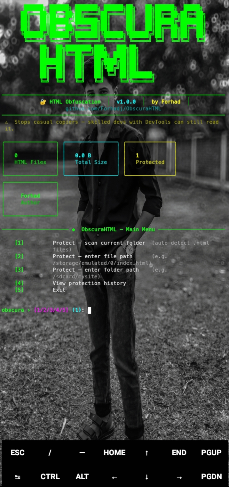

<div align="center">

<!-- Animated Banner -->


<br/>


<br/><br/>


</div>

---

<div align="center">

```
┌─────────────────────────────────────────────────────────────────────┐
│  ⚠  HONEST DISCLOSURE                                               │
│                                                                     │
│  This tool stops casual copiers, scrapers & bots.                  │
│  A skilled dev with DevTools can always recover the source.         │
│  Goal: "annoying to reverse" — not "impossible to reverse".         │
└─────────────────────────────────────────────────────────────────────┘
```

</div>

---

## 📸 Screenshot

<div align="center">

</div>

---

## ✨ What is ObscuraHTML?

**ObscuraHTML** is a Python CLI tool that wraps your HTML files in a **self-decrypting JavaScript shell** — making it extremely annoying for casual copiers, bots, and scrapers to steal your source code.

The protected file is **100% self-contained** — it decrypts itself in the browser using the **Web Crypto API**. No server needed.

```
Your HTML  ──►  Minify  ──►  Compress  ──►  Encrypt  ──►  Polymorphic Loader  ──►  Protected HTML
```

---

## 🔐 Protection Levels

<div align="center">

| Feature | L1 · Stealth | L2 · Armored ⭐ | L3 · Fortress | L4 · Ghost 🆕 |
|---------|:-----------:|:--------------:|:-------------:|:-------------:|
| Safe HTML minify | ✅ | ✅ | ✅ | ✅ |
| Deflate compress | ✅ | ✅ | ✅ | ✅ |
| Brotli compress (if available) | ❌ | ✅ | ✅ | ✅ |
| SHA-256 integrity check | ✅ | ✅ | ✅ | ✅ |
| Chunked base64 encoding | ✅ | ✅ | ✅ | ✅ |
| pako / DecompressionStream fallback | ✅ | ✅ | ✅ | ✅ |
| AES-256-GCM encryption | ❌ | ✅ | ✅ | ✅ |
| XOR-SHA256 fallback | ❌ | ✅ | ✅ | ✅ |
| Polymorphic loader | ❌ | ✅ | ✅ | ✅ |
| 9 decoy variables | ❌ | ✅ | ✅ | ✅ |
| Blob URL loader (no eval) | ❌ | ❌ | ✅ | ✅ |
| Anti-debug setInterval trap | ❌ | ❌ | ✅ | ✅ |
| DevTools detection overlay | ❌ | ❌ | ✅ | ✅ |
| 14 decoy variables | ❌ | ❌ | ✅ | ✅ |
| Key rotation on reload | ❌ | ❌ | ❌ | ✅ |
| Self-destruct on tamper detection | ❌ | ❌ | ❌ | ✅ |
| Obfuscated CSP headers injected | ❌ | ❌ | ❌ | ✅ |
| 20+ decoy variables | ❌ | ❌ | ❌ | ✅ |

</div>

> ⭐ **Level 2 (Armored)** is recommended for most use cases — best balance of protection and compatibility.
> 👻 **Level 4 (Ghost)** is maximum protection — for highly sensitive HTML projects.

---

## 📂 Two File Input Modes

ObscuraHTML supports two ways to select your HTML file:

**Mode 1 — Pick from list (option `[1]`)**

Scans the current directory and shows a numbered table.
Just type the number and press Enter.

**Mode 2 — Enter any path (option `[2]`)**

```bash
# Android (Termux)
/storage/emulated/0/mysite/index.html
/sdcard/projects/landing.html

# Linux / macOS
~/Downloads/page.html
/home/user/projects/site/index.html

# Windows
C:\Users\User\Desktop\index.html

# Relative path (any OS)
./subfolder/index.html
../parent/file.html
```

---

## 🚀 Installation

### 📱 Termux (Android) — Recommended for mobile

```bash
pkg update -y && pkg upgrade -y

pkg install python git clang rust make openssl openssl-dev libffi libffi-dev -y

pip install --upgrade pip setuptools wheel

pip install rich pycryptodome brotli

git clone https://github.com/Forhadj/ObscuraHTML.git
cd ObscuraHTML

python main.py
```

### 🐧 Linux / macOS

```bash
git clone https://github.com/Forhadj/ObscuraHTML.git
cd ObscuraHTML
pip install rich pycryptodome brotli
python main.py
```

### 🪟 Windows

```bash
git clone https://github.com/Forhadj/ObscuraHTML.git
cd ObscuraHTML
pip install rich pycryptodome brotli
python main.py
```

> `brotli` is optional — the tool falls back to `zlib/deflate` automatically. JS side always uses deflate for browser compatibility.

---

## 🎮 Usage

```bash
python main.py
```

**Main Menu:**

```
╔══════════════════════════════════════════════════════════╗
║           ObscuraHTML v6.0 — Main Menu                  ║
╠══════════════════════════════════════════════════════════╣
║  [1]   Protect file from current directory              ║
║  [2]   Protect file from any path                       ║
║  [3]   Batch protect all .html files here               ║
║  [4]   View protection history                          ║
║  [5]   Settings & Config                                ║
║  [6]   About / Help                                     ║
║  [7]   Exit                                             ║
╚══════════════════════════════════════════════════════════╝
```

Output is saved as `obscura_protected_<filename>.html` in the same directory as the source file.

---

## ⚙️ How It Works

<details>
<summary><b>🔍 Click to expand — detailed pipeline</b></summary>

<br/>

```
┌──────────────────────────────────────────────────────────┐
│                    SOURCE HTML FILE                      │
└─────────────────────┬────────────────────────────────────┘
                      │
                      ▼
          ┌───────────────────────┐
          │   1. SAFE MINIFY      │  Skips <script> <style>
          │                       │  <pre> <textarea> blocks
          └───────────┬───────────┘
                      │
                      ▼
          ┌───────────────────────┐
          │   2. COMPRESS         │  Brotli (L2+) or
          │                       │  Deflate zlib level=9
          └───────────┬───────────┘
                      │
                      ▼
          ┌───────────────────────┐
          │   3. SHA-256 HASH     │  Computed on compressed
          │                       │  bytes (tamper detection)
          └───────────┬───────────┘
                      │
                      ▼
          ┌───────────────────────┐
          │   4. AES-256-GCM      │  L2+ only
          │      ENCRYPT          │  Key embedded in JS
          │                       │  (obfuscation grade)
          └───────────┬───────────┘
                      │
                      ▼
          ┌───────────────────────┐
          │   5. POLYMORPHIC      │  Random variable names
          │      LOADER BUILD     │  Decoy variables
          │                       │  Chunked base64 arrays
          └───────────┬───────────┘
                      │
                      ▼
          ┌───────────────────────┐
          │   6. BLOB URL WRAP    │  L3+ only — no eval()
          │      (L3/L4 only)     │  Dynamic import()
          └───────────┬───────────┘
                      │
                      ▼
          ┌───────────────────────┐
          │   7. GHOST LAYER      │  L4 only
          │      (L4 only)        │  Key rotation
          │                       │  Self-destruct on tamper
          └───────────┬───────────┘
                      │
                      ▼
┌──────────────────────────────────────────────────────────┐
│               PROTECTED HTML OUTPUT                      │
│   Self-decrypts in browser via Web Crypto API            │
│   No server required — 100% client-side                  │
└──────────────────────────────────────────────────────────┘
```

In the browser, the reverse happens:

1. JS decrypts with embedded key (AES-GCM or XOR fallback)
2. Verifies SHA-256 integrity hash
3. Decompresses with `DecompressionStream` or pako fallback
4. Injects HTML via `DOMParser` — no `document.write()`

</details>

---

## 🛡️ Security Statement

<details>
<summary><b>⚠️ Click to read — important honesty note</b></summary>

<br/>

| Claim | Reality |
|-------|---------|
| Key is secure | ❌ Key is embedded in JS — DevTools can extract it |
| AES-256-GCM is used | ✅ Correctly implemented — algorithm is sound |
| Stops scrapers/bots | ✅ Yes — automated tools can't easily parse it |
| Stops casual copiers | ✅ Yes — Ctrl+U / view-source shows nothing useful |
| Stops skilled developers | ❌ No — determined devs with DevTools can always recover source |
| No eval() used | ✅ Level 3/4 uses Blob URL + dynamic import() instead |
| Integrity checking | ✅ SHA-256 on compressed bytes — detects file tampering |
| Self-destruct (L4) | ✅ Page wipes itself if tamper is detected |

**Bottom line:** ObscuraHTML raises the effort required to copy your HTML from ~2 seconds to ~20 minutes. That's the goal — **annoyance, not impossibility.**

</details>

---

## 📁 Project Structure

```
ObscuraHTML/
├── main.py               ← main tool (all-in-one, v6.0)
├── requirements.txt      ← Python dependencies
├── install.sh            ← auto installer (Termux + Linux)
└── README.md
```

---

## 📦 Requirements

```
rich          >= 13.7.0    (terminal UI)
pycryptodome  >= 3.20.0    (AES-256-GCM)
brotli        >= 1.1.0     (optional — fallback to zlib)
```

---

## 📜 Changelog

<details>
<summary><b>v6.0.0 — Current 🆕</b></summary>

✅ **NEW:** Level 4 (Ghost) protection — maximum obfuscation layer  
✅ **NEW:** Key rotation on every reload (L4)  
✅ **NEW:** Self-destruct on tamper detection (L4)  
✅ **NEW:** Brotli compression support (L2+) with auto-fallback  
✅ **NEW:** `main.py` entry point — cleaner launch command  
✅ **NEW:** Settings & Config menu — persistent user preferences  
✅ **NEW:** Protection history — last 100 operations saved locally  
✅ **NEW:** 20+ polymorphic decoy variables (L4)  
✅ **NEW:** Obfuscated CSP headers injection (L4)  
✅ `eval()` completely removed — Blob URL + dynamic import() (L3+)  
✅ Brotli label confusion fixed — JS always uses deflate path  
✅ AES key honestly labeled as "obfuscation-grade" in UI  
✅ `document.write()` completely removed — replaced with `createElement`  
✅ SHA-256 integrity now computed on compressed bytes  
✅ XOR fallback uses pure JS PRNG — no `crypto.subtle` dependency  
✅ Safe HTML minifier — skips `<pre>`, `<script>`, `<style>`, `<textarea>`  
✅ Anti-debug `setInterval` trap (L3+)  
✅ DevTools detection overlay (L3+)  
✅ Termux full path support (`/storage/emulated/0/...`)  

</details>

<details>
<summary><b>v5.0.0</b></summary>

✅ eval() removed from Level 3 — replaced with Blob URL + dynamic import()  
✅ Brotli label confusion fixed  
✅ AES key honestly labeled  
✅ document.write() completely removed  
✅ SHA-256 integrity on compressed bytes  
✅ XOR fallback pure JS PRNG  
✅ Safe HTML minifier  
✅ Anti-debug trap + DevTools detection (L3)  
✅ Two file input modes  
✅ Termux full path support  
✅ Redesigned terminal UI  

</details>

---

## 🤝 Contributing

Pull requests are welcome! For major changes, please open an issue first.

```bash
git fork https://github.com/Forhadj/ObscuraHTML.git
git checkout -b feature/your-feature
git commit -m "Add: your feature"
git push origin feature/your-feature
```

---

<div align="center">

## 👤 Author


**Forhad Hassan**

[](https://github.com/Forhadj)


---


</div>
